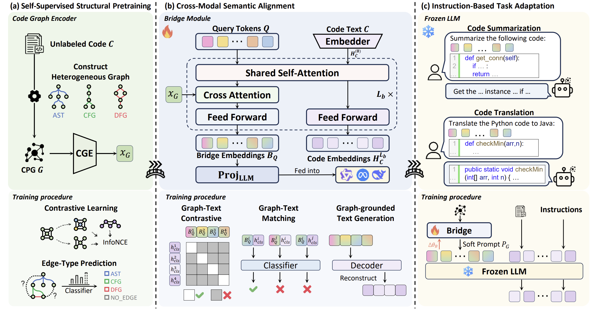

# CGBridge: Bridging Code Graphs and Large Language Models for Better Code Understanding



CGBridge is a novel framework designed to enhance the code understanding capabilities of Large Language Models (LLMs) by integrating rich structural information from code graphs. Our approach follows a systematic three-stage training pipeline to effectively bridge the modality gap between graph structures and textual code representations.

- **Stage 1: Self-supervised Structural Pretraining.** We train a powerful Code Graph Encoder (CGE) to learn meaningful representations of code graphs through self-supervised tasks, including graph-level contrastive learning and edge-type prediction.

- **Stage 2: Cross-Modal Alignment.** We introduce a "bridge" module, initialized to align the learned graph embeddings from Stage 1 with the semantic space of natural language and code text.

- **Stage 3: Instruction-based Task Adaptation.** The aligned graph representations are used as soft prompts for a frozen LLM, which is then instruction-tuned on various downstream code understanding tasks, such as code summarization and translation.

---

## Setup & Prerequisites

### 1. Clone the Repository

*Note: The repository is currently provided as an anonymous link for review purposes. The official public repository will be made available upon acceptance.*

```bash
# Clone the repository using the provided anonymous URL
git clone <https://anonymous.4open.science/r/CGBridge>
cd CGBridge
```


### 2. Environment Setup

   It is recommended to use Conda for environment management.

```bash
conda create -n CGBridge python=3.9
conda activate CGBridge
pip install -r requirements.txt
```

### 3. Download Pre-trained Models

   Create a `models/` directory in the project root and download the required pre-trained models:

- **Code Encoder:** A model for initial node embeddings, e.g., [microsoft/unixcoder-base](https://huggingface.co/microsoft/unixcoder-base).
- **BERT for Bridge Module:** The base language model for initializing the bridge module, i.e., [bert-base-uncased](https://huggingface.co/bert-base-uncased).
- **Large Language Model (LLM):** The backbone LLM for Stage 3, such as Qwen-Coder, CodeLlama, or DeepSeek-Coder.

### 4. Download and Prepare Datasets

- **Download Raw Data:**
  
  - **Code Summarization:** Download the [CodeSearchNet](https://github.com/github/CodeSearchNet) dataset (Python subset).
  - **Code Translation:** Download the [XLCost](https://github.com/reddy-lab-code-research/XLCoST) dataset (Python-Java pair).
  
  Place the raw dataset files into their respective task directories, for example: `tasks/summarization/code_datasets/` and `tasks/translation/code_datasets/`.

- **Refine Source Data:**
  To ensure the quality of our source data, we performed a refinement step. This process is crucial for training a high-performing model but is also resource-intensive.
  
  - **For Summarization:** We used the `tasks/summarization/summary_refinement.py` script to generate high-quality docstrings for code snippets. The prompt used is detailed in our paper's Appendix D.1 and can also be found in our stage 3 configuration files (e.g., `configs/stage3_configs/summ-*.yaml`).
  - **For Translation:** We used the `tasks/translation/format_code.py` script to correct syntax and format the code, ensuring its functional correctness and executability.
  
  Given the significant computational resources (including LLM API calls) required for this refinement, we are in the process of preparing the final, refined datasets for public release. A direct download link will be made available here soon.

### 5. Experiment Environment

Our experiments were conducted on the following environment:

- **GPU:** 8 x NVIDIA H800 80GB
- **CPU:** Intel(R) Xeon(R) Platinum 8470 @ 3.8GHz
- **OS:** Ubuntu 22.04.4 LTS

---

## Stage 1: Code Graph Encoder (CGE) Pre-training

This stage focuses on building graph representations from source code and training the Code Graph Encoder (CGE) to understand them.

### 1.1. Dataset Preparation

The raw datasets must be preprocessed into a `.csv` or `.pkl` format. Each row should contain at least one column holding the source code snippet (e.g., named `code` or `src_code`). The script `scripts/CSN_raw_to_pkl.py` provides an example of this process for CodeSearchNet.

### 1.2. Graph Construction

This step converts the preprocessed code snippets into structured graph datasets.

- **Process:** The core logic is in `scripts/python_code_graph.py`. For each code snippet, it uses `tree-sitter` to build an Abstract Syntax Tree (AST). From the AST, Control Flow Graph (CFG) and Data Flow Graph (DFG) edges are derived. The nodes (AST components) are embedded using a pre-trained encoder like UniXcoder.
- **Edge Embedding Cache:** To accelerate the process, you can pre-calculate and cache the embeddings for all possible edge types using `scripts/make_edge_embs_cache.py`.
- **Execution:** Run the `scripts/construct_graph.sh` script to perform graph construction on your dataset. This script executes `scripts/pkl_to_graph.py`, which handles the batch processing and saves the final graphs as `.pt` files (e.g., in `tasks/summarization/graph_datasets/`).

### 1.3. CGE Training

- **Model:** The `CodeGraphEncoder` (defined in `models/CodeGraphEncoder.py`) is trained using a dual-objective function: a graph-level contrastive loss and an edge-type prediction loss.
- **Configuration:** Training parameters, such as GNN type (GCN, GAT, or GraphTransformer), dimensions, and loss weights, are defined in YAML files located in `configs/stage1_configs/`. An example is `gt-ACD-2.yaml`.
- **Execution:** The `trainers/train_cge.sh` script launches the training process using `accelerate` for distributed training, managed by `trainers/CGE_Trainer.py`.

---

## Stage 2 & 3: Bridge Training and Task Adaptation

These stages connect the powerful graph representations to an LLM for downstream tasks.

### 2.1. Feature Extraction for Alignment

After Stage 1, the trained CGE is used to generate a single, fixed-size embedding for every code graph in the dataset. The `produce.py` script (called from `trainers/train_cge.sh`) handles this, creating a paired `.csv` dataset containing `(code, graph_embedding)` pairs. This dataset is the input for Stage 2.

### 2.2. Stage 2: Cross-Modal Semantic Alignment

- **Goal:** This stage trains the bridge module (see `models/CGBridge_Stage2.py`), which is a language model initialized from `bert-base-uncased`, to align the graph embeddings with the corresponding code text semantics. 
- **Training:** The `trainers/CGBridge_Stage2_Trainer.py` script manages this alignment process using three objectives:
  - **GTC (Graph-Text Contrastive):** Ensures that matching graph and text pairs have similar representations.
  - **GTM (Graph-Text Matching):** A finer-grained task to predict if a given graph-text pair is a positive match or a hard negative.
  - **GTG (Graph-to-Text Generation):** A generative task where the model learns to reconstruct the code text from the graph embedding.

### 2.3. Stage 3: Instruction-based Task Adaptation

- **Goal:** The pre-trained CGE and the aligned bridge module from the previous stages are now connected to a large language model (LLM). The bridge module effectively translates the code graph into a series of soft prompt embeddings, guiding the LLM's understanding and generation process.
- **Training:** The model is fine-tuned on downstream tasks. The weights of the bridge module obtained from Stage 2 are shared across all Stage 3 tasks.
- **Execution:** The following scripts demonstrate the full workflow for Stage 2 and 3:
  - `trainers/train_bridge_stage2&3.sh`: An example for running Stage 2 and then Stage 3 for the code translation task.
  - `trainers/train_bridge_stage3.sh`: An example for running Stage 3 for the code summarization task.

### 2.4. Inference

Once a model is trained, you can use the provided scripts to generate outputs for your test data.

- **Code Summarization:** Use `tasks/summarization/generate.py`. An example command is provided at the bottom of the script. It takes the path to your trained model, the dataset split you want to evaluate, and an output directory.
- **Code Translation:** Use `tasks/translation/translate.py`. Similarly, an example command at the end of the script shows how to run it with your trained model, dataset, and output path.

### 2.5. Evaluation

We provide a comprehensive suite of evaluation scripts for both tasks.

- **For Summarization:**
  
  - **Reference-based:** `tasks/summarization/evaluate_summaries.py` calculates standard metrics like BLEU, ROUGE-L, METEOR, and BERTScore against reference summaries.
  - **Reference-free:** `tasks/summarization/llm-as-judge.py` uses a powerful external LLM (e.g., GPT-4) to assess the quality of generated summaries without needing a ground truth reference. **Note:** This requires configuring your own API keys.

- **For Translation:**
  
  - **Code Correctness:** `tasks/translation/check_java_compilation.py` attempts to compile the generated Java code using `javac` to check for syntactic and semantic correctness.
  - **Code Quality:** `tasks/translation/evaluate_translations.py` calculates the CodeBLEU score, which evaluates the quality of translated code by considering n-gram matches, syntactic AST similarity, and data-flow similarity.

---

## Case Analysis for Code Translation

### Failure Cases


### Good Cases


## Case Analysis for Code Summarization

Only the summary section is shown.

### Bad Cases


### Good Cases

